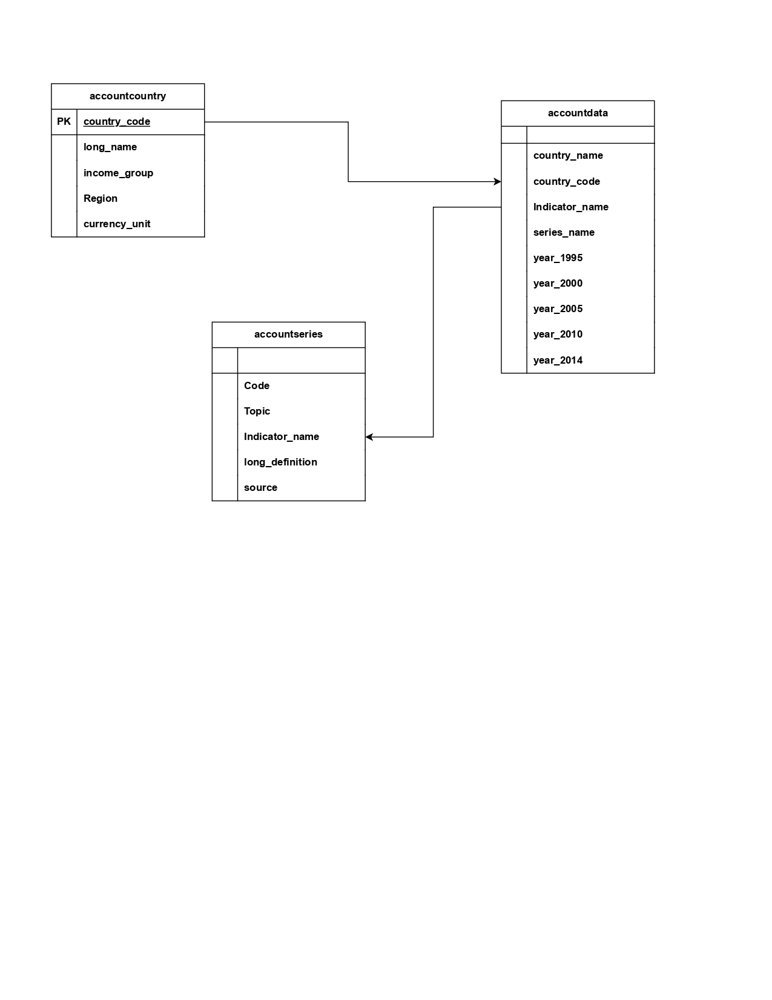

# Database_Design
Here wants to build a basic data model by using accounts dataset which have 3 tables. 

## Introduction 
In today's data-driven world, efficient database design is crucial for managing, retrieving, and analyzing data effectively. This project focuses on designing a robust database system using PostgreSQL, a powerful open-source relational database management system, and Python, a versatile programming language widely used in data engineering and analytics.

The project aims to develop a comprehensive database architecture for managing accounts-related data, encompassing three main tables: accountdata, accountcountry, and accountseries. These tables are designed to store, relate, and manage complex data about account details, their associated countries, and relevant time series information.

accountdata: Contains detailed information about each account, such as country name, country code, indicator name, series name and year realated information.

accountcountry: Stores information about the countries associated with each account, including country code, long name, Income group, Region and currency units.

accountseries: It conatins columns like code, topic, Indicator name, long definition, source 

The primary goal of this project is to create a normalized and efficient database structure that supports data integrity, quick access, and scalability. Additionally, Python scripts are developed to facilitate data manipulation, validation, and integration tasks, leveraging libraries like SQLAlchemy and Pandas for database interaction and data processing.

This design will serve as a foundation for advanced data analysis, providing valuable insights into account behaviors and trends across different geographical regions and time periods.

## Architecture Diagram 

