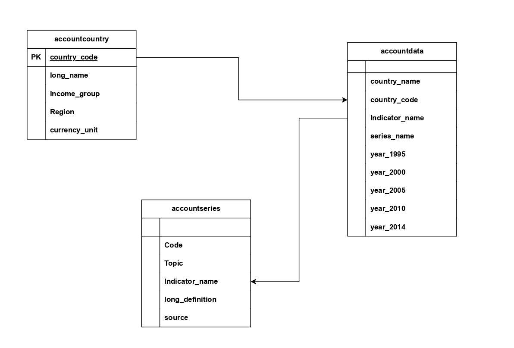

# Database_Design
Here wants to build a basic data model by using accounts dataset which have 3 tables. 

## Introduction 
In today's data-driven world, efficient database design is crucial for managing, retrieving, and analyzing data effectively. This project focuses on designing a robust database system using PostgreSQL, a powerful open-source relational database management system, and Python, a versatile programming language widely used in data engineering and analytics.

The project aims to develop a comprehensive database architecture for managing accounts-related data, encompassing three main tables: accountdata, accountcountry, and accountseries. These tables are designed to store, relate, and manage complex data about account details, their associated countries, and relevant time series information.

accountdata: Contains detailed information about each account, such as country name, country code, indicator name, series name and year realated information.

accountcountry: Stores information about the countries associated with each account, including country code, long name, Income group, Region and currency units.

accountseries: It conatins columns like code, topic, Indicator name, long definition, source 

The primary goal of this project is to create a normalized and efficient database structure that supports data integrity, quick access, and scalability. Additionally, Python scripts are developed to facilitate data manipulation, validation, and integration tasks, leveraging libraries like Pandas for database interaction and data processing.

This design will serve as a foundation for advanced data analysis, providing valuable insights into account behaviors and trends across different geographical regions and time periods.

## Data Model 

## Technology Used
  - Programming language : Python, SQL
  - Database : Postgres

## Dataset Used 
Here we used Accounts dataset which have three tables namely accountdata, account, accountseries.

Dataset link : https://github.com/ASK0805/Database_Design/tree/main/Account%20Dataset

## Script For The Project
[Accounts_Data_Modelling.ipynb](Accounts_Data_Modelling.ipynb)

## Steps Involve In Project 
Here we divide our project in 3 stages :
### Stage 1 :
To start, we cleaned our dataset by removing unnecessary columns using Pandas. From the AccountCountry dataset, we selected relevant columns such as Code, Long Name, Income Group, Region, and Currency Unit. For the AccountData dataset, we focused on columns like Country Name, Country Code, Series Name, Series Code, and data for the years 1995 [YR1995], 2000 [YR2000], 2005 [YR2005], 2010 [YR2010], and 2014 [YR2014]. Lastly, in the AccountSeries dataset, we selected columns including Code, Topic, Indicator Name, Long Definition, and Source.

### Stage 2 :
In this stage, we first established a connection to our database using the host, database name, password, and other required credentials. After connecting, we created a new database named accounts and used it for creating our tables. We created three tables: accountcountry, accountdata, and accountseries, all of which are connected through primary keys.

### Stage 3 :
At the last we insert all the data into table by using python one by one.

